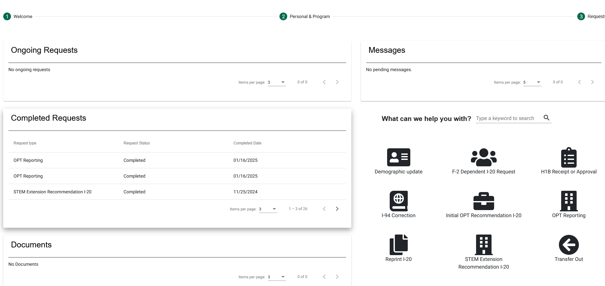
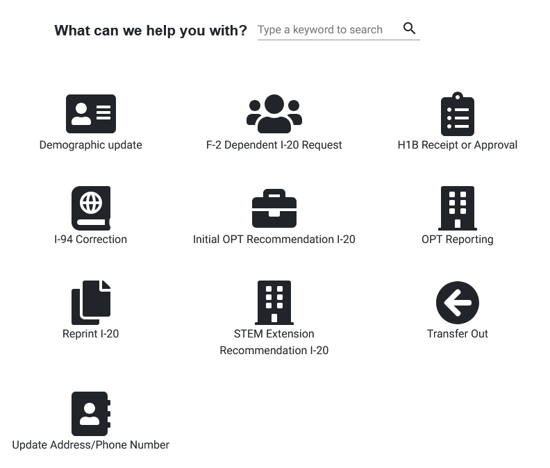
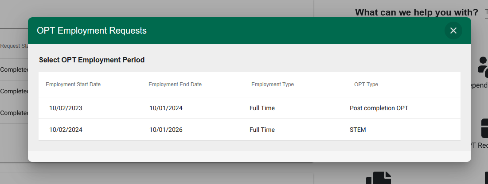
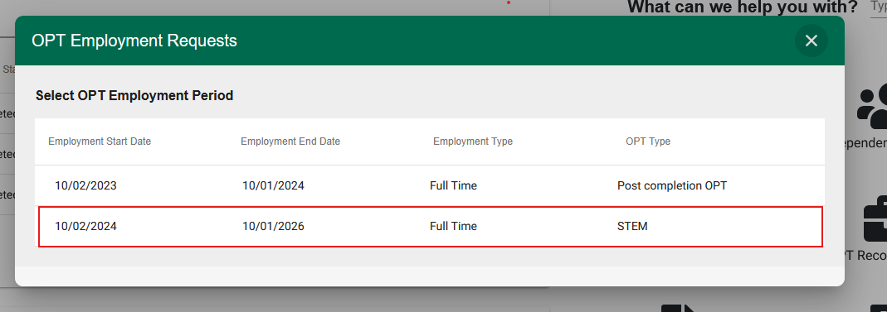
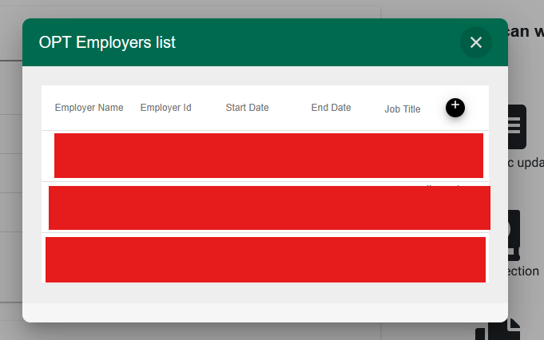
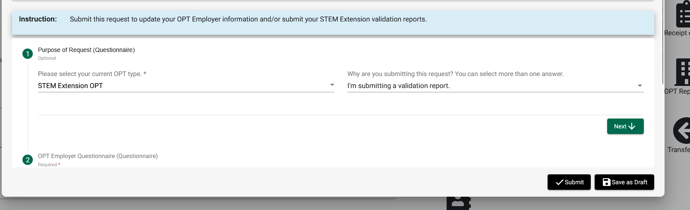

### Introduction

This guide is for students of Northwest Missouri State University who are currenlty in STEM OPT exteinsion program. As we are expected to report to our DSO university via IIC portal and update the information in SEVIS portal. Follow the steps below to submit the validation report.

### Step 1: Things to do in IIC portal

#### 1.1 steps to OPT reporting section 

- logic to IIC student portalA
- scroll down the botton until we see OPT reporting section

- select the OPT reporting section

- open STEM section of employement information 
we are only expected to validate the information in STEM section

click on the stem section in any white space available

futher we will see all the employer details in this section selection, it will look something like this

We now have to validate all the information for each employer in this section

#### 1.2 Validate the information for each employer

select similar information for each emploer from the provided dropdown list

After this verify all the infomration in below sections when you scroll down 