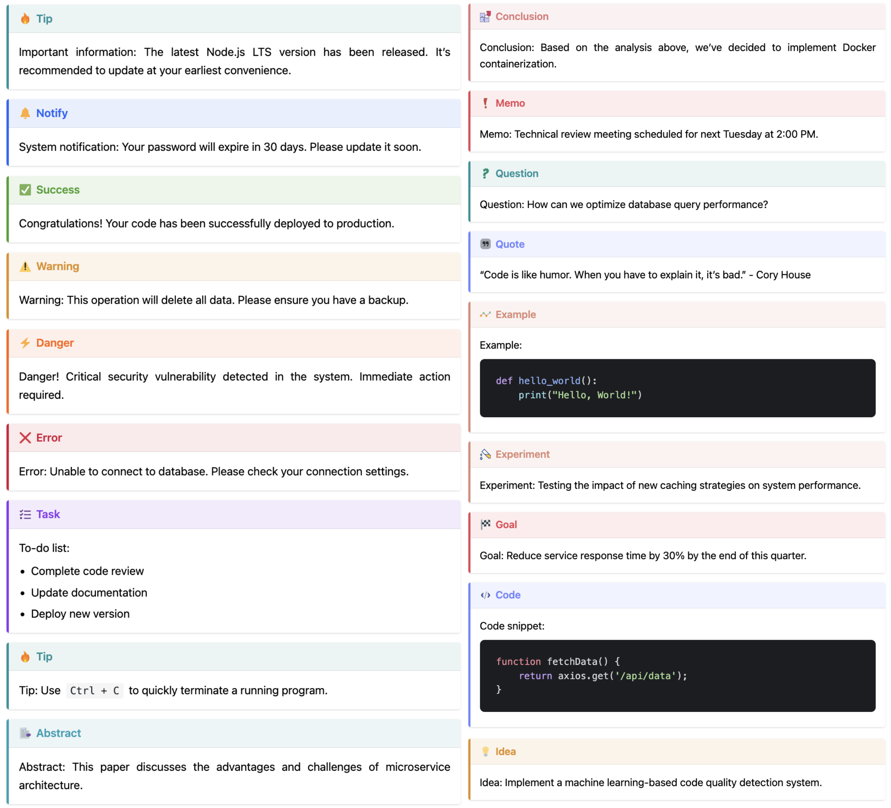
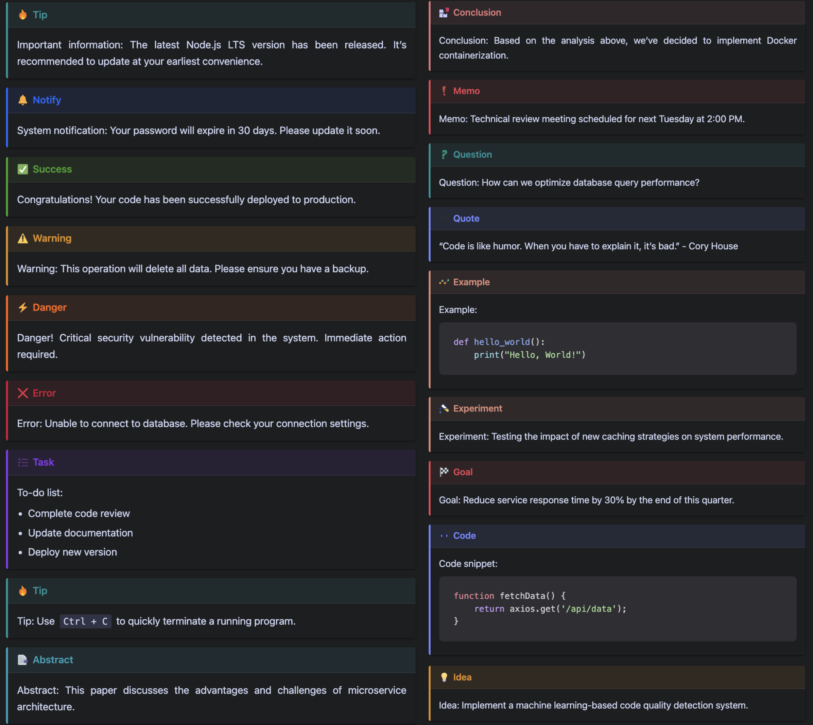
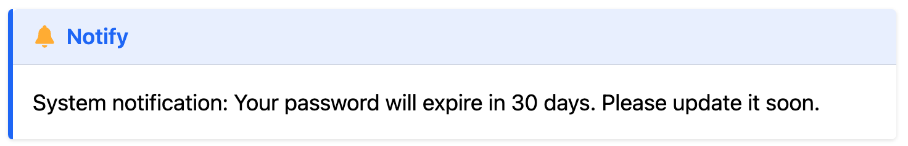
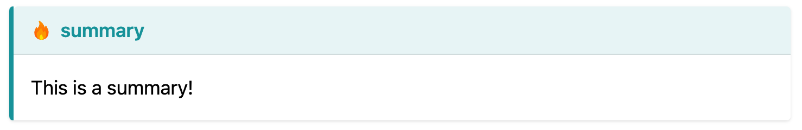

# hugo-admonitions

Simple admonitions for hugo.

Inspire from [mdbook-admonish](https://tommilligan.github.io/mdbook-admonish/)

## Overview of all admonitions

### Light Mode



### Dark Mode



## Installation

1. Inside the folder of your Hugo site, run:

```bash
git clone git@github.com:KKKZOZ/hugo-admonitions.git themes/hugo-admonitions

```

2. Add `hugo-admonitions` as the left-most element of the theme list variable in your site's or theme's configuration file `hugo.yam`l or `hugo.toml`.

    Example, with `hugo.yaml`:

    ```yaml
    theme: ["hugo-admonitions", "my-theme"]
    ```

    or, with `hugo.toml`,

    ```toml
    theme = ["hugo-admonitions", "my-theme"]
    ```

## Usage

Use the shortcode in this way:

```

System notification: Your password will expire in 30 days.

```



Or you can customize the title:

```go

This is a summary!

```


